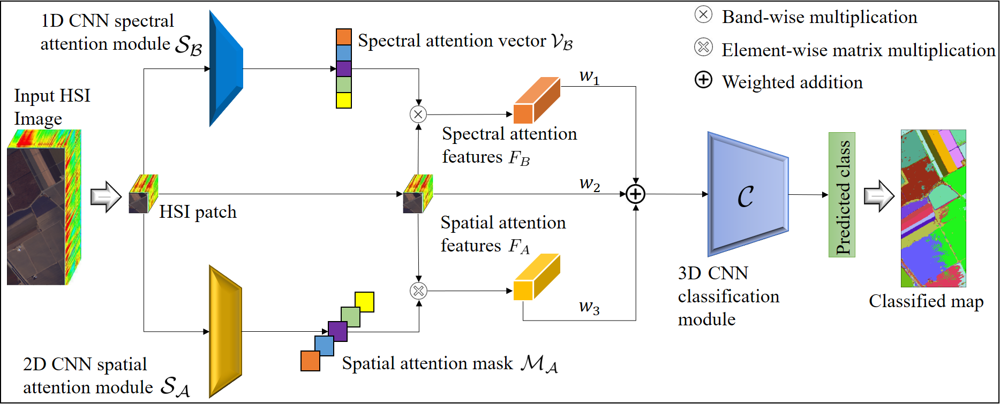

# Adaptive-Hybrid-Attention-for-Hyperspectral-Image-classification

The task of land cover classification from hyperspectral images (HSI) has recently witnessed sharp improvements with the applications of deep convolutional networks (CNN). This is mainly attributed to the hierarchical spectral-spatial feature learning capabilities of the CNN models. However, it is important to encode the short to long range spatial dependencies to predict the pixelwise labels without inducing additional redundancy at the feature level. The standard CNN based land cover classification models for HSI overlook this aspect in general. To overcome this, we propose a hybrid attention based 3D classification model for hyperspectral images. Our model comprises of 1D and 2D CNNs to individually generate the attention masks that respectively highlight the spectral and spatial characteristics of our input image. For optimal learning the spectral and spatial features in our model are combined adaptively with the original input and sent to the 3D classification module. To enhance the classification performance, we incorporate classwise Wasserstein loss alongwith the crossentropy loss. Our methods are evaluated on three widely used hyperspectral datasets: Houston datasets (DFC-2013 and DFC-2018) and Salinas dataset, and has satisfactorily outperformed all the prior benchmark methods.

>URL to the paper: [Paper](https://www.sciencedirect.com/science/article/pii/S0167865521000283?ref=cra_js_challenge&fr=RR-1)
